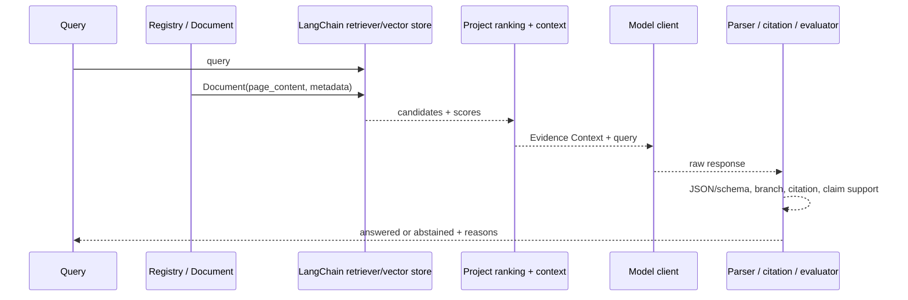

# D6 固定 LangChain RAG 代码导读

> 对象：当前 `week13-rag/src/w13rag/`、D5 dense 接线和 dev runner。函数名对应当前源码；验证只使用 dev 与已保存证据。
> 本文解释代码职责，不新增 Prompt、eval、阈值或 LangGraph runtime。

## 1. 一条可复核的数据流

## 2. 代码入口与职责

1. **输入与身份**：`source.read_doc()` 读取冻结 snapshot 的 bytes 和 1-based 行模型；`parser.parse_blocks()` 产生 `BlockInfo`。`registry.entry_from_block()` 调用 `serialize.build_model_content()`，形成 `source_id`、`source_span`、`context_spans`、`model_content` 和正文 hash。
2. **Document 映射**：`retrieval.to_documents()` 将每个 registry entry 变为 LangChain `Document`。`page_content` 逐字节复用 `model_content`；metadata 只携带 `source_id`、位置、hash 和 `registry_index`，供项目层回映射。
3. **BM25 retriever**：`retrieval.build_retriever()` 调用 `BM25Retriever.from_documents()`；`tokenize()` 负责中文 bigram 和 NFKC 归一化。`retrieve()` 读取底层 `get_scores()`，按分数降序、`registry_index` 升序排序，去重后生成 `RetrievalHit`。
4. **Dense adapter 与向量库**：`retrieval_dense_langchain.E5Embeddings` 在 adapter 内加入 `passage: ` / `query: ` 前缀。`load_cached_matrix()` 检查缓存 identity 和矩阵形状；`assert_unique_source_ids()` 防止向量库键静默覆盖；`build_dense_store()` 以冻结 `source_id` 装载 `InMemoryVectorStore`。`dense_retrieve_langchain()` 取回全部候选分数，再由项目层排序并映射 `RetrievalHit`。
5. **Context assembly**：`retrieval.build_retrieval_context()` 建立 `source_id → entry` 映射，按 hits 取回 `model_content`，复用 `serialize_source_block()` 和 `assemble_evidence_context()`。`context_budget.assemble_with_budget()` 是独立的预算审计路径；旧检索链当前没有把预算裁剪接入运行主路径。
6. **Prompt 与生成**：`generation.assemble_messages()` 通过 `build_user_message()` 把 Evidence Context 和 query 放进固定标签；`run_item()` 复用 W12 `DeepSeekClient`，记录 requested/served model、usage、latency、原始响应和状态。
7. **解析与分支**：`generation.check_response()` 依次执行空内容检查、`json.loads()` 和 JSON Schema 校验，产生 `ok`、`empty_content`、`json_error`、`schema_error`、`http_error`、`timeout_error` 或 `transport_error`。`scoring.evaluate_item()` 再分开计算 branch、claim、citation、evidence coverage 和 claim support；`decide_item()` 用冻结契约合取得到 answered、abstained 或 pending。

## 3. 失败路径如何区分

| 失败层 | 识别位置 | 例子 | 当前边界 |
|---|---|---|---|
| retrieval miss | `requirement_recall()` / retrieval evidence | 目标 source block 未进入 top-k | 交集命中不等于完整证据 |
| context assembly | `build_retrieval_context()` 或预算审计 | 命中块未进入实际 context、顺序/hash 不一致 | 当前小输入未触发裁剪压力 |
| schema / parser | `check_response()` | 结构不符合 `rag-response-v1` | `status=ok` 只表示结构通过 |
| transport | `run_item()` | timeout、HTTP 或客户端异常 | W13 固定 `no-retry` |
| generation semantics | `scoring.py` 人工 evaluator | 错误 branch、claim 不被原文支持 | 需要本人语义判定 |
| evaluation failure | `decide_item()` / split aggregation | 合取条件未满足、阈值或分母缺失 | 不回写历史结果或 holdout |

## 4. 当前实现与后续边界

已实现：冻结 source identity、Document 映射、BM25、dense adapter/vector store、项目层稳定排序、Evidence Context、现有模型客户端、response parser、分层 evaluator 和 dev 证据回放。

未实现：LangChain `ChatModel`/LCEL、LangGraph state/node/edge/retry/termination/trace runtime、agent loop、生产级向量数据库与通用 RAG 质量保证。

## 5. 验证证据索引

- dense 等价性：`scripts/verify-dense-langchain-equiv.py`，10 条 dev query，top-10 order/set 一致，最大分数差 `7.31e-08`。
- 确定性测试：`tests/test_retrieval_dense_langchain.py` 与全量测试合计 81 passed（D5 记录）。
- 端到端链路：`evidence/bm25-e2e/dev-bm25-e2e-top10-01.json` 与 `evidence/dense-langchain-e2e/dev-dense-langchain-e2e-top10.json`；两轮人工语义判定各 3/10，均不作质量通过。
- 离线重算：`scripts/demo-replay.py verify` 重建 hits、context 字符数与 hash；不发模型请求、不读取 holdout。
