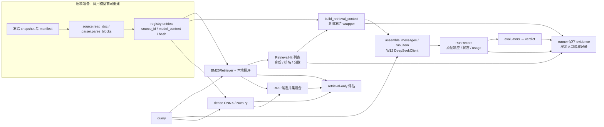
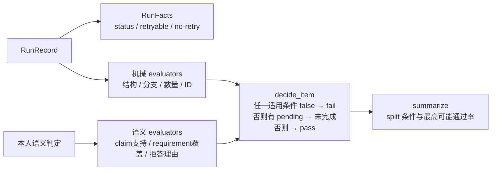

# W13 RAG 代码导读：从来源块到回答与评估

> 复核日期：2026-09-11。对象：当前 `src/w13rag/` 实现及 dev runner、离线展示入口。
> 本文解释实际职责与已有取舍，不新增 RAG 框架、冻结决定或掌握结论。旧的
> [serialization 六模块导读](../src/w13rag/README.md)继续承担输入处理细节与 Python/TypeScript 对照。
> 质量与进度证据见 [D4 记录](./day4-full-context-baseline-and-bm25.md)和 [D5 审核](./day5-progress-audit.md)。

## 1. 先看当前实现的完整范围

当前已有一条 BM25 端到端路径。它用 LangChain 的 `Document` 与 `BM25Retriever` 建立检索输入，之后由本地
代码执行确定性排序、上下文组装、W12 客户端调用和评分。dense 与 hybrid 已做 retrieval-only 对照，尚无对应的
端到端 generation 运行；LangGraph workflow 也尚未实现。

图中 dense/RRF 只连到已运行的检索评估。全语料 baseline 直接把完整 Evidence Context 交给同一个
`run_item()`，跳过 query → retrieval；它并不经过 BM25。

| 阅读对象 | 输入 → 输出 | 核心文件与符号 |
|---|---|---|
| 读取与块边界 | 文档字节 → 行模型 → `BlockInfo` | [source.py](../src/w13rag/source.py) `read_doc`；[parser.py](../src/w13rag/parser.py) `parse_blocks` |
| 来源身份与可见正文 | 核心/附加 spans → registry entry 与完整 Evidence Context | [registry.py](../src/w13rag/registry.py) `entry_from_block` / `build_entries`；[serialize.py](../src/w13rag/serialize.py) |
| 候选检索 | query + 同一 registry → 排名与 `RetrievalHit` | [retrieval.py](../src/w13rag/retrieval.py)、[retrieval_dense.py](../src/w13rag/retrieval_dense.py)、[retrieval_hybrid.py](../src/w13rag/retrieval_hybrid.py) |
| 本次上下文 | hits + registry → 实际模型可见证据字符串 | `retrieval.build_retrieval_context` → `serialize_source_block` → `assemble_evidence_context` |
| 请求与运行状态 | system + context + query → `RunRecord` | [generation.py](../src/w13rag/generation.py) `assemble_messages` / `run_item` / `check_response` |
| 判定与证据 | 运行记录 + 机械/人工检查 → item/split 结论与证据 JSON | [scoring.py](../src/w13rag/scoring.py)；[run-bm25-e2e.py](../scripts/run-bm25-e2e.py) |

[`cli.py`](../src/w13rag/cli.py)调度前两项的构建与验证；[`__init__.py`](../src/w13rag/__init__.py)只是包入口。
六项是阅读分组，不是新增框架抽象。

## 2. 读取与块边界：先确定引用到底指向什么

**问题**：模型生成一个“引用位置”还不足以回源。必须先由程序固定文档版本、行号和 block 边界，后续引用才有
可查的对象。此处读取冻结 snapshot；当前仓库根目录中同名文件的新增内容不会自动进入本轮 corpus。

`source.read_doc()` 读取 bytes、剥除 BOM、统一 CR/CRLF 为 LF，形成 `SourceDoc.lines` 与 `has_lf`。
内部数组是 0-based，对外 `line_text()` 和来源范围是 1-based、包含两端。`has_lf` 保留末行是否确实带换行，
避免重建正文时悄悄多一个或少一个字节。

`parser.parse_blocks()` 只决定核心行范围、祖先标题、表头、code 行和块类型，返回 `BlockInfo` 列表及 code 行集合。
它不生成答案，也不判断 query relevance。列表项、表格行、fenced code 与 blockquote 的处理来自
[D2 source block 决定](./day2-freeze-eval-contract.md) §6.1。

**为什么分开**：读文件和保留行模型解决字节/位置问题；parser 解决块归属。这样可以分别定位“来源行读错”与
“段落切错”，也能让序列化用合成 `SourceDoc` 验证，不依赖 parser 的全部行为。

**当前代价与边界**：这是针对冻结规则文档实现的 Markdown 子集，未证明任意 CommonMark 输入都正确。
嵌套 blockquote、lazy list continuation 等扩展输入需要重新核对支持范围。覆盖审计只能证明正文行没有漏掉或重复，
不能证明每个 block 的语义粒度最优。

## 3. Registry 与 serialization：位置身份和正文完整性各自负责一件事

`registry.entry_from_block()` 调用 `serialize.build_model_content()`，按已冻结顺序组装：祖先标题 → 必要表头
→ 核心 source span。它生成一个 entry：

| 字段 | 当前来源与用途 | 不能替代什么 |
|---|---|---|
| `source_id` | `corpus_id/source_path#Lstart-Lend`；标识核心位置 | 不证明正文内容正确 |
| `source_span` | 与 ID 相同的核心行范围 | 不包含复制来的标题/表头 |
| `context_spans` | 附加标题与表头的位置、role | 不是 retrieval 排名，也不扩大核心 ID |
| `model_content` | 实际送给模型的 block 正文 | 不包含外层 source wrapper |
| `content_sha256` | `model_content` UTF-8 全字节的 hash | 不检查 wrapper、块顺序或全串边界 |

`build_entries()` 按 manifest 文档顺序和核心行范围排序，拒绝重复 ID，并检查正文不会与 source wrapper 冲突。
`serialize_source_block()` 将 ID 与正文包在固定标签中；`assemble_evidence_context()` 再连接各块。
完整 Evidence Context 有独立的整串 hash，覆盖单块正文 hash 不包含的 wrapper、顺序和分隔符。

**为什么这样实现**：ID 让回答能定位来源；正文 hash 让同一位置的内容变化可见；整串 hash 让组装变化可见。
仅对 parser 输出跑两次并比较相同，无法发现“两次都稳定地错了”。因此还使用手工期望 fixture、真实语料不变式、
独立重算和冻结整串基准。对应入口是 `cli.build_once()`、`audit_document()`、`cmd_verify()`。

**当前代价与边界**：必要标题/表头会重复进入多个 blocks，增加模型输入；当前总输入计量包含这些开销，但没有
分别隔离每一项的 token 增量。`cmd_verify()` 比较 fresh / 磁盘 Evidence Context / 可选冻结基准，不等同于验证所有
磁盘文件都未被改动。

## 4. Retrieval：用同一种结果形状比较三种检索方法

### 4.1 BM25 的实际 LangChain 调用

依次读 `retrieval.to_documents()` → `build_retriever()` → `retrieve()`。

1. `to_documents()` 把每个 registry entry 映射为 LangChain `Document`。`page_content` 与冻结 `model_content`
   完全同源；metadata 保存 `source_id`、`content_sha256`、`source_path`、`line_start`、`line_end`、`registry_index`。
2. `build_retriever()` 调用 `BM25Retriever.from_documents(..., preprocess_func=tokenize)`，底层使用 `rank_bm25`。
3. `retrieve()` 调用 `retriever.vectorizer.get_scores(tokenize(query))`，再按分数降序、同分按 `registry_index`
   升序排序，按 `source_id` 去重并取 top-k，返回 `RetrievalHit`。

**为什么不直接使用默认输出**：冻结设计要求可见 score 和稳定的同分顺序，而默认 retriever 返回的是 Documents。
因此保留 LangChain 装载和底层 BM25 计算，显式完成排序与结果包装。此路径没有调用 `retriever.invoke()` 来决定
最终顺序，也没有建立完整的 LangChain Runnable 链。

**中文预处理为什么另写**：默认按空白拆分不能把连续中文拆成可比较的检索 tokens。冻结 `tokenize()` 使用 NFKC
和小写化，中文连续段切相邻 bigram、拉丁字母/数字按非字母数字边界切词。query 与文档使用同一 tokenizer。
该处理只改变检索表示，`page_content` 原文不变；BM25 仍不自行建立同义关系。

这些取舍来自 [B1–B4 冻结记录](./bm25-design-freeze.md)，不表示 bigram 对所有中文任务最好。

### 4.2 Dense 的实际运行路径

依次读 `retrieval_dense.embed_texts()`、`build_corpus_embeddings()`、`embed_queries()`、`dense_retrieve()`。
文档使用 `passage: ` 前缀，query 使用 `query: ` 前缀；e5 tokenizer 产生模型输入，ONNX Runtime 在 CPU 上输出
hidden states，按 `attention_mask` 做 mean pooling，再 L2 归一化。检索用 `matrix @ query_vector` 得到 cosine
相似度，最终也产出 `RetrievalHit`。

**为什么统一结果而不改 registry**：BM25 与 dense 改变“如何得到排名”，但保留来源身份、核心行范围及后续检索
判据，使调用者可以比较同一 corpus/dev 上的结果。该比较替换的是整套检索表示和排序方法，不是相同表示下只换
一条打分公式。

**实际框架边界**：当前 dense 直接读取 registry，使用 `AutoTokenizer`、`onnxruntime.InferenceSession` 与 NumPy；
未接 LangChain `Embeddings`、`VectorStore` 或 `BaseRetriever`，也没有向量数据库和 ANN 索引。当前是 572 行向量
矩阵上的完整相似度计算。

**已冻结条件与未验证代价**：模型、512-token 上限、pooling、归一化、CPU provider 等见
[D1–D4 冻结记录](./dense-design-freeze.md)。缓存命中可避免重复计算 passage embeddings；当前 identity 记录模型/
tokenizer hash、长度、pooling、归一化、块数和 batch，但没有语料正文 hash 或 entry 顺序。因此它依赖本轮语料
保持冻结；同块数换内容或换顺序时，不能宣称现有缓存身份会自动识别。模型文件来源真实性也未以官方 hash 交叉验证。

### 4.3 Hybrid 为什么使用 RRF

`retrieval_hybrid.rrf_fuse()` 对两个候选列表的**并集**，按 `source_id` 累加 `1 / (60 + rank)`，再排序取 top-k。
每个 ranker 的候选池为 top-50；融合只比较排名贡献，不把 BM25 score 与 cosine 数值直接相加。

**能做什么**：只被一个 ranker 找到的块仍可进入结果；同时被两个 ranker 找到的块会获得两份贡献。
**不能做什么**：两个候选池都没有的块不会凭空产生。RRF 不判断规则是否适用，也不保证融合一定改善最终排名。
当前输出为本地 RRF 结果，不是 LangChain `EnsembleRetriever`；这是一项已按退出条件收口的扩展对照。

## 5. Context assembly：模型看到的是来源正文，不是候选对象

`retrieval.build_retrieval_context(hits, entries)` 先建立 ID → entry 映射，再按 hits 顺序取得每个 entry 的
`model_content`。之后复用冻结 `serialize_source_block()` 与 `assemble_evidence_context()`。

| 对象 | 主要内容 | 在当前链路中的去向 |
|---|---|---|
| `RetrievalHit` | 来源身份、rank、score、行范围、registry index | runner 的诊断与证据；用于决定拿哪些 entry |
| 单块模型输入 | wrapper 中的 source ID + `model_content` | 进入模型 Evidence Context |
| 实际 context | 本次选择的 blocks 按顺序连接后的字符串 | `run_item()` 的输入，并记录 chars / SHA |

**为什么另设这一步**：检索结果是应用对象，模型需要字符串；将二者分开，才能查明“检索拿到了但没有进入模型”
和“进入模型后没有被正确使用”的区别。请求组装不会重新检索或分配 source ID；回答中的 citation 仍由模型
生成，需要继续校验。当前机械评估只检查 registry 可解析性，实际 context 与语义支持边界见 §7。

**当前边界**：full-context 按 registry 顺序，BM25 context 按检索排名；对照同时改变块集合、顺序和输入长度。
冻结 B3 描述了超预算裁剪规则，但当前 `build_retrieval_context()` 没有执行 token 计量或裁剪，只拼接给定 hits；
当前小型输入未触发预算压力，不能把“未触发”讲成“裁剪分支已实现并验证”。

## 6. Generation：一次调用的运行事实与答案质量分开

先读 `generation.system_instructions()` 与 `assemble_messages()`。system 只取 Prompt 文件的 §1；user 里
分别放 `<EVIDENCE_CONTEXT>` 与 `<QUERY>`。expected branch、reference conclusion、evidence requirements
属于评测输入，不发送给模型。完整输入计量与真实请求复用同一组装函数，减少两套模板漂移；离线 tokenizer
结果仍是 estimate，实际 `usage` 由 provider 返回。

`run_item()` 通过 W12 [`DeepSeekClient`](../../week12-python-rag/src/clients.py)发送一次请求，显式传入已冻结的
model 请求值、`thinking`、`max_tokens`、`response_format`。run runner 创建 client，并在 `finally` 中关闭。
W13 没有复制第二套 HTTP client，也没有改成 LangChain ChatModel。

响应经过 `check_response()`：先检查空内容，再 `json.loads()`，再本地 `jsonschema.validate()`。正常和已分类
错误共七态：

| 状态 | 所在边界 |
|---|---|
| `ok` | 内容通过 JSON 解析和 response schema |
| `empty_content` | 响应正文为空 |
| `json_error` | 正文不是可解析 JSON |
| `schema_error` | JSON 不满足响应结构 |
| `http_error` | 客户端报告 API HTTP 错误 |
| `timeout_error` | HTTP 请求超时 |
| `transport_error` | 已捕获的 HTTP/客户端传输类错误 |

`RunRecord` 同时保留原始文本、parsed 对象、请求模型值、服务端返回身份、usage、延迟和错误详情。`ok` 只表示
结构检查通过，错误拒答或 unsupported claim 仍可能发生。JSON mode 也不等于 provider 按指定 schema 生成；
当前 schema 仍由本地验证。

**为什么不用失败就自动重试**：W13 冻结 `retry_policy="no-retry"`；`retryable` 只是分类字段。程序取消或未在
`run_item()` 捕获范围内的编程错误仍可能向上传播，不能把 docstring 简写理解为任何异常都变成 `RunRecord`。
LangGraph 的重试、state 与 checkpoint 只属于后续映射，并未在本轮执行。

## 7. Scoring 与 evidence：回答是否通过由多项检查共同决定

### 7.1 检索评估与回答评估各看什么

`retrieval.requirement_recall()` 检查 retrieved span 与 requirement span 在同一文档是否有交集，同时记录覆盖
行数比例。`evaluate_item_retrieval()` 要求该题全部适用 requirements 命中；no-answer 的相邻 source span 仅作
advisory，因此有效 dev retrieval 分母为 8。行范围有交集不等于内容完整支持答案。

回答评估以 [`scoring-contract.md`](../eval/scoring-contract.md) 为规则依据；`scoring.py` 用代码实现判据，
不在运行时读取该 Markdown。当前 `scoring.evaluate_item()` 将结果拆为：

**为什么拆三部分**：运行状态描述请求发生了什么，evaluator 描述某一维度是否符合规则，verdict 再应用合取。
一个待人工判断的条件不能遮住已经确定的失败；一个可解析 ID 也不能替代“这段话支持该 claim”的判断。
结构失败按契约使 item 失败，不通过人工读出“看起来合理”来翻转。

**具体限制**：机械 `citation_precision` 当前只算返回 identifiers 在 registry 中的可解析比例，与契约完整指标
还要求的语义支持不同。`evaluate_item()` 接收的是 registry IDs，未独立接收本次 actual context；因此它自身
不能额外证明每条 citation 都在此次检索上下文中。人工结论使用独立 worksheet 保存，旧 JSON 不因后来判定自动更新。
当前 full-context 的 4/10 还带有 R1 在运行后澄清的诊断边界。

### 7.2 谁负责保存、重评与展示

| 入口 | 实际工作 | 为什么放在 runner / 展示层 |
|---|---|---|
| [cli.py](../src/w13rag/cli.py) | 构建 registry / 完整 Evidence Context 与审计产物 | 纯函数处理内容，CLI 决定文件输出 |
| [measure-input-budget.py](../scripts/measure-input-budget.py) | 使用共享组装函数计量输入并保存 estimate | 容量证据和质量判定分开 |
| [run-dev-baseline.py](../scripts/run-dev-baseline.py) | 完整 context + dev queries → 单次模型调用与分层记录 | 不把 baseline 误叫检索链 |
| [run-retrieval-eval.py](../scripts/run-retrieval-eval.py) | BM25/dense/hybrid 的同集检索评估、性能与配置记录 | 不调用生成模型；保留检索层信号 |
| [run-bm25-e2e.py](../scripts/run-bm25-e2e.py) | 每题检索、context、一次生成、机械评分与 evidence JSON | 保留 query 到响应的可复核关联 |
| [rescore-baseline.py](../scripts/rescore-baseline.py) | 用当前机械评估层读取旧 dev 运行记录 | 评分代码可复核，不重新生成模型响应 |
| [demo-replay.py](../scripts/demo-replay.py) | 读取固定 dev 证据；展示记录、来源；可离线重算 BM25/context | 现场无模型网络依赖，也不冒充新生成 |

BM25 evidence 的 `hits` 与 context SHA/chars 允许用同一 registry 重建当次 Evidence Context；完整请求还包括 Prompt 和 query。`record` 保存 provider 原始
输出与 usage，`evaluation` 保存当时判定状态。版本、配置与来源信息在 runner 中关联，不能把单独一段答案脱离
该次输入拿来比较。

`demo-replay.py verify` 重算 10 条已记录 query 的检索顺序、context SHA 和字符数；`case --section source`
额外检查首条 citation 属于该次 hits，并回读其冻结核心行。它不批量判定全部 claim 支持关系，也不产生新答案。
脚本退出 0 说明该执行完成；generation runner 的质量结论须读 `summary.split_status`，不能用 shell 退出码代替。

## 8. 从当前实现连接到 LangChain / LangGraph

| 已有职责 | 当前实际实现 | 后续框架学习的对应对象与边界 |
|---|---|---|
| 文档正文与 metadata | LangChain `Document` 已用 | 继续保持冻结 source identity，不以临时 ID 替代 |
| BM25 ranking | `BM25Retriever` 装载 + 底层 score + 本地稳定排序 | 如改为标准 retriever 调用，仍需核对 tie-break、score 与结果 metadata |
| Dense embedding / search | ONNX + NumPy + 本地缓存 | `Embeddings` / `VectorStore` / retriever 是后续接线目标，当前未完成 |
| Prompt / 模型调用 | 本地字符串组装 + W12 client | LangChain Prompt / ChatModel / Runnable 可对应这些职责；不能因职责可映射就算已使用 |
| 运行与评估 | `RunRecord`、evaluators、verdict | LangGraph 可编排节点/state；外部 eval 仍判断质量，不能由图运行成功替代 |
| 重试、继续检索或结束 | W13 单次固定路径、no-retry | W14 才冻结 Agent 控制与权限后实现 LangGraph workflow |

**可以这样讲**：“我先固定了来源、上下文与判分边界，再把 BM25 接到 LangChain。这样替换检索组件时，我能观察
排名变了什么，也能核对模型究竟看到了哪些内容。当前 dense 和生成仍用直接调用路径；下一步的框架实践需要沿着
这些边界接线和复核，而不是把现有手写函数改名就算完成 LangChain 或 LangGraph。”

## 9. 本次导读 review 与完成边界

| 发现 | 核对依据 | 本次处理 |
|---|---|---|
| 原导读只覆盖 serialization 六模块 | 当前包已新增 retrieval/dense/hybrid/generation/scoring | 保留原导读作为细节页，新增本页并双向导航 |
| RRF 注释把 cosine 写成 0–1，把任一 ranker miss 写成无法召回 | cosine 一般范围为 [-1,1]；`rrf_fuse` 遍历两列表并累加到同一 dict | 只订正注释；实际候选并集合并行为不变 |
| generation 注释写五类失败 | 实际常量是 `ok` 加六种错误 | 注释改为六类错误，不改状态或运行行为 |
| baseline runner 把语义 pending 一律描述为 split incomplete | `scoring.summarize()` 可由确定失败直接判 fail | 订正 docstring 与新证据的说明字符串；评分逻辑、旧 evidence 不变 |
| 容易将缓存、预算规则与 context 验证写成完整保障 | cache identity、`build_retrieval_context`、`evaluate_item` 实际参数与分支 | 在对应小节保留未实现或未验证边界，不把候选优化补成已冻结方案 |

推荐阅读次序：§1 总图 → §4 BM25 → §5 实际上下文 → §6 生成 → §7 判定；需要解释来源稳定性时回读 §2–§3，
需要框架问答时使用 §8。掌握是否完成仍由本人实际复述、review、变更预测和延迟重建验证，本页不代签。

本次文档检查：45 个本地链接目标存在；`generation.py`、`retrieval_hybrid.py` 去除模块 docstring 后的 AST 与
改动前一致；baseline runner 仅改说明文字。无阻断性导读问题，可以验收；上述现存实现限制未被写成完成。
