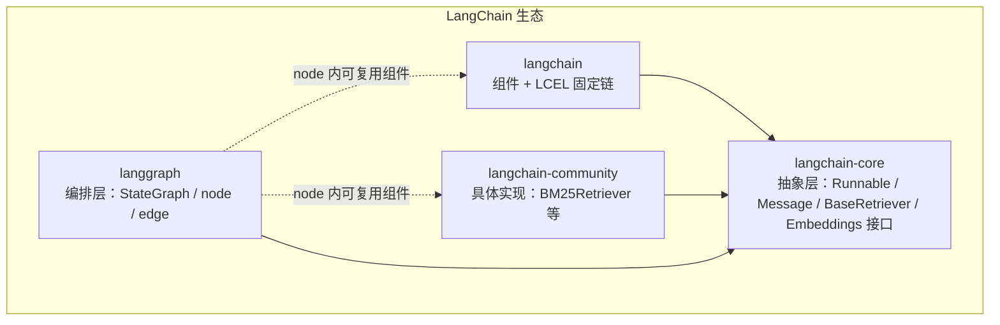
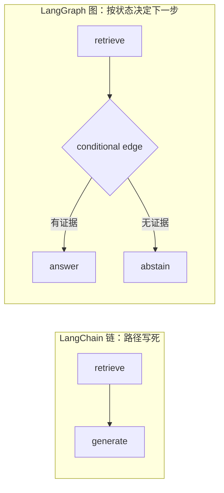
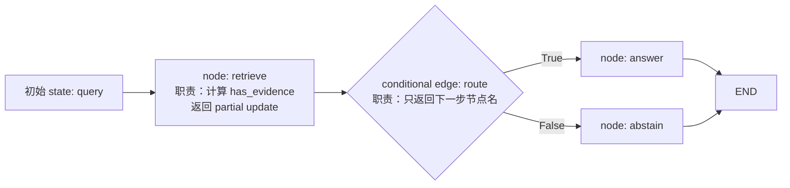

# W14 D2 学习笔记：LangChain/LangGraph 生态分界与最小控制流

> 摘要：今日完成 LangChain（组件 + 固定链）与 LangGraph（状态编排）的职责分界讲解，纠正了「BM25Retriever 属于 langchain-core」的误判，确立「接口在 core、具体实现在集成包」的归属判据。因临时面试占用时间，本日压缩为概念学习，尚未进入最小 StateGraph demo。

## 今日目标 / 计划变化

D2 原定恢复 D1 入口并进入 graph wiring；临时面试占用学习时间，压缩为一个下午的概念学习：先讲清 LangChain 与 LangGraph 的职责分界，再进入最小 StateGraph。实际完成前者，demo 顺延。

## 需求与概念

### 1. LangChain 生态：三个层次，不是两个并列框架

LangChain 与 LangGraph 不是两个平级框架，而是同一生态里的不同层，共享地基 `langchain-core`。

要点：

- `langgraph` 依赖 `langchain-core`，不依赖完整 `langchain`；`langchain` 与 `langgraph` 是平级的用途包。
- 依赖方向：具体实现 import core 的接口，但代码住在自己的包。**依赖 ≠ 归属。**

### 2. 链 vs 图：职责分界

LangChain 管「每一步做什么」（组件 + 固定流水线），LangGraph 管「下一步走哪、何时停」（状态 + 控制流）。

### 3. 最小控制流对象与职责

职责分离：node 只计算（返回 partial update），conditional edge 只路由（返回节点名），引擎驱动 state 在节点间流转。

### 4. 术语与类比对照（本人给出，AI 复核）

类比仅作助记，后续指称用官方术语；删除类比后官方术语必须能单独承载语义。

| 官方术语 | 类比 | 类比不能覆盖的边界 |
|---|---|---|
| `State` | store（Redux store） | state 是不可变合并更新，不是可变引用订阅；context 类比稍弱 |
| `node` | 返回 patch 的 handler | node 允许副作用（调模型/检索），不是纯 reducer |
| `conditional edge` | 返回 next route 的 guard | 更接近「路由解析函数返回目标节点」，不是布尔放行 |
| `CompiledGraph` | 合并 state + 调度的 runtime | 官方术语是 `CompiledGraph`（compile 后产物） |

**与 Redux 的同构**：`node(state) → partial update → engine 合并 → new state` 对应
`dispatch(action) → reducer(state, action) → new state`。

**关键差异**：Redux 的「下一个 reducer」隐式固定；LangGraph 用 edge 显式声明下一步，conditional edge
让下一步由 state 动态决定——这是「链做不到、图做得到」的控制流显式化。

## 自检与纠正

| 类 | 归属包 | 导入路径 |
|---|---|---|
| Embeddings | langchain-core | `langchain_core.embeddings.Embeddings` |
| InMemoryVectorStore | langchain-core | `langchain_core.vectorstores.InMemoryVectorStore` |
| BM25Retriever | langchain-community | `langchain_community.retrievers.BM25Retriever` |

- 原判断：BM25Retriever、Embeddings 都是 langchain-core（理由：底层依赖）。
- 偏差：把「依赖 core 的协议」误当成「属于 core」。
- 修正判据：看完整导入路径的顶层包名（`langchain_core.` / `langchain_community.` / `langchain.`）。
- 已联网核实：LangChain 官方 API reference；`bm25` docs 页 404（归属结论以 api reference 路径为准）。

## 验证证据

- 环境：复用 W13 venv（W14 无独立环境）；`langgraph` 1.2.11、`langchain-core` 1.6.2、`langchain-community` 0.4.2。
- 最小 StateGraph 两条分支（[脚本](week14-langgraph/scripts/minimal_state_graph.py)）：
  - `query="有证据的问题"` → `{'query': ..., 'has_evidence': True, 'branch': 'answer'}`
  - `query=""` → `{'query': '', 'has_evidence': False, 'branch': 'abstain'}`
- 印证：最终 state 由初始 `query` + `retrieve` 的 `has_evidence` + `answer`/`abstain` 的 `branch` 三段 partial update 累积合并而成。

## 已完成 / 未完成

- 已完成：生态分界讲解、链 vs 图职责分界、归属判据纠正、术语复述通过、最小 StateGraph demo 跑通（两条分支可见）。
- 未完成：`w13-eval-debt-rebuild-01`（未做）、task contract / baseline / trace-verifier（顺延 D3）。

## 明日入口

D3 起进入真实 RAG 接入 graph（retrieve/generate/verify node）与 task contract / baseline / trace-verifier 冻结。
