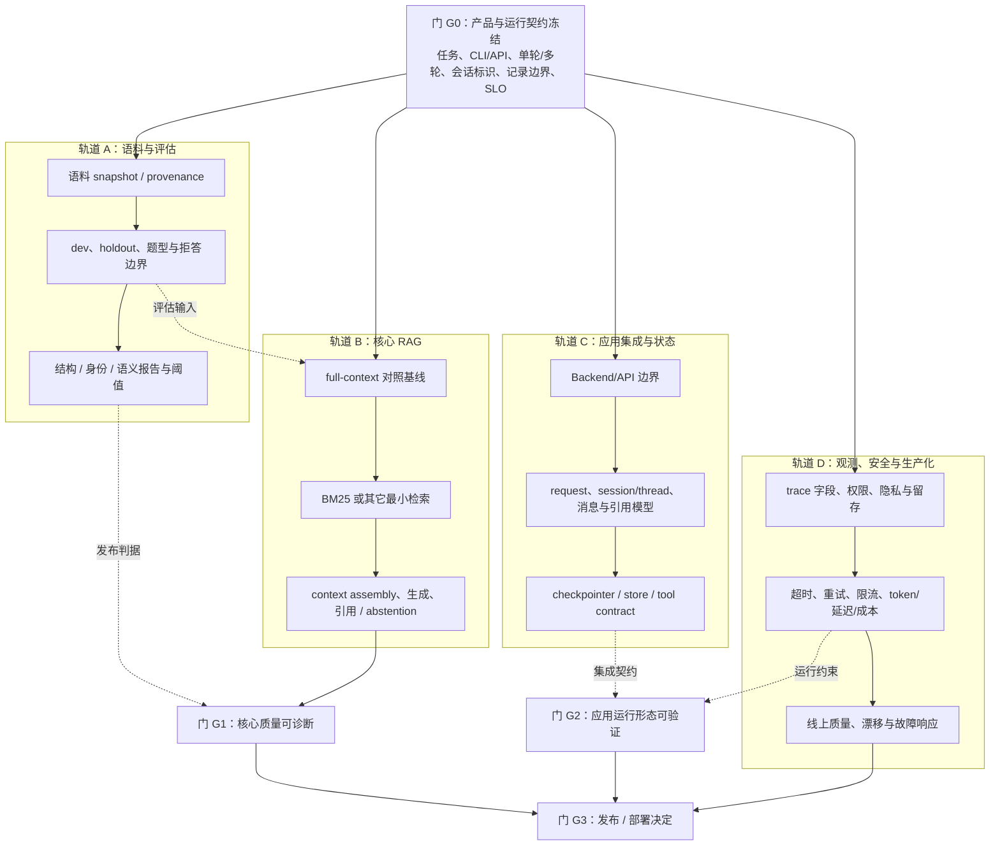

# 生产导向 RAG 工具：从目标到可发布系统的工作流程

> 建立：2026-09-14（Asia/Shanghai）。修订：2026-09-14。本文根据 `AGENTS.md` §1.4、W13 踩坑复盘、W13 实际边界和生产工作场景重新组织，不是某个权威标准原文。
> 用途：复述 RAG 工具的工作方式；为后续把 RAG 嵌入现有 Backend、Agent 或独立工具提供规划入口。
> 当前状态：W13/W14 已完成受限的 CLI/固定链路切片和部分 LangChain 接线，尚未完成 Backend API、会话持久化、生产 trace、Agent/tool 接入或部署。
> 边界：本文中的目标、运行契约、评估判据、阈值、权限和发布条件必须由本人冻结；本文不把未来目标写成已完成。

## 先区分当前切片与最终目标

W13 的决定是时间受限条件下的最小可重复链路：

```text
query → retrieval → context assembly → generation → citation / abstention → eval
```

入口可以是 CLI，不新增 UI；自定义实现只保留框架无关契约、全语料上下文基线、可解释检索对照和必要 adapter，不扩展为向量数据库或 Agent。这是一个有效的学习和诊断切片，但不是产品运行形态的完整定义。

最终目标是能嵌入现有 Backend，按产品契约提供 RAG 工具或 Agent 能力。是否需要 API、单轮或多轮会话、`thread_id`、消息和引用持久化、trace、数据库、向量库、工具调用和 LangGraph 状态编排，应由运行契约、规模、租户、隐私和运维要求决定。MongoDB 不是 RAG 的必需组件；它只是满足某些持久化、查询、权限或现有 Backend 集成要求的一种实现选项。

因此，当前没有 Backend、MongoDB 或对话历史，首先表示这些对象尚未被当前 CLI 切片实现；它不自动表示规划遗漏，也不自动表示它们已经排在某个“最后阶段”。未来是否实现，必须在运行契约中作出决定并形成对应交付物。

## 工作方式：并行轨道与依赖门

生产 RAG 不适合表达成“阶段 0 完成后只能做阶段 1，阶段 1 完成后才能做阶段 2”的单链条。它更适合用一个共同的运行契约约束多个可以并行推进的轨道，再用依赖门决定哪些结果可以进入下一步。



图中的箭头表示依赖或发布门，不表示所有工作必须串行完成：

- **G0 是共同前置**：没有目标任务、最小行为和运行形态，评估对象、接口和 trace 字段都可能漂移。
- **轨道 A 与 B 可以交替推进**：语料和评估契约要先提供最小输入；基线结果又可能暴露题集、切块或拒答边界需要修订。正式 holdout 和发布阈值冻结后，不得按结果反复调参。
- **轨道 C 可以与 A/B 并行做契约和胶水**：Backend API、session/thread、消息模型和工具接口可以先定义；核心 RAG 质量未通过时，不能把集成完成写成产品可发布。
- **轨道 D 可以提前设计并逐步接入**：trace schema、权限、隐私、留存、超时和成本观测不应全部堆到最后；线上告警和部署规模只有在应用运行形态确定后才能定稿。
- **G1、G2、G3 是不同门**：核心回答质量、应用运行形态和生产发布条件分别验收；某一轨道暂未需要数据库，不阻塞没有持久化需求的 CLI 交付，但会阻塞声明支持会话历史或审计留存的产品交付。

## 阶段 0：冻结产品与运行契约（共同前置）

阶段 0 不只写“用户问题进入、回答返回”，还要冻结产品运行边界：

- **目标任务**：解决什么用户任务，允许回答哪些问题，证据不足时如何拒答。
- **最小行为**：`query → retrieval → context → generation → citation/abstention`，以及调用方可观察的返回状态。
- **运行入口**：CLI、内部函数、HTTP API 或消息接口；明确当前切片和目标 Backend 的边界。
- **交互形态**：单轮还是多轮；若为多轮，定义 `session_id` / `thread_id` 的生成、传递、隔离和终止。
- **记录对象**：是否保存 query、回答、引用、检索命中、模型请求、usage、延迟、错误和人工反馈；区分响应记录、会话历史和可回放 trace。
- **状态与持久化**：是否需要 checkpointer、store、消息库、向量库或缓存；明确这些对象解决的是状态、查询、规模、租户或运维问题。
- **权限与隐私**：哪些内容可进入模型、日志和 trace；谁能读取原文、引用、会话和成本数据；留存和删除条件是什么。
- **SLO 与资源边界**：延迟、可用性、token、成本、并发、超时、重试和降级行为。
- **明确不做**：当前版本排除的 UI、Agent loop、持久会话、数据库、联网检索或部署能力，分别记录为“未纳入当前切片”，不写成永远不需要。

阶段 0 应至少产生一张版本化的系统边界图和一份运行契约。它不要求立刻实现全部 Backend，但要求读者能看出未来实现需要哪些对象。

## 轨道 A：语料、评估和证据契约

1. **语料**：版本化 snapshot、切块策略、provenance。本项目采用 `source_id + span + hash` 作为 provenance 设计；其它系统可按数据和审计需求选用不同字段和格式。
2. **评估集**：题型、可回答/无答案/冲突情形、拒答边界、结构/身份/语义判据和阈值。正式评估或发布门禁前冻结阈值，记录来源、版本和变更理由。
3. **分层报告**：保留结构、身份、语义等原始维度和失败原因；可以生成总 verdict，但不能把分层证据压成不可诊断的单布尔。
4. **数据卫生**：dev 与 holdout 物理分离；holdout 不用于选方案或调参。仓库受保护评测内容遵守 `AGENTS.md` 的访问边界。

## 轨道 B：核心 RAG 链路

1. **full-context 对照基线**：在上下文预算允许时，把完整语料作为同模型、同 Prompt、同生成设置下的对照；它用于回答“在当前设置下检索是否带来价值”，不是跨设置的质量上限。
2. **检索最小基线**：先跑 BM25 或其它可解释的最小检索。`source@k` 是基础 hit/recall 诊断；按任务补充 rank-aware、span/claim coverage 和生成质量指标。
3. **增量变量**：只有基线结果或明确对比假设支持时，才增加 dense、RRF、query rewrite、rerank 等变量。引入 hybrid 前测量 overlap、union recall、增量命中、质量收益和成本；overlap 是诊断，不是所有系统的硬门槛。
4. **上下文和生成**：命中 → Evidence Context（身份、顺序、截断、token 预算）→ ChatModel 或现有 model client → schema/parser → citation/abstention。
5. **失败归因**：区分 corpus、retrieval、context assembly、prompt、generation 和输出验证的失败；每次变量变更绑定一个决策、假设和验证动作。

## 轨道 C：Backend、会话、Agent 与工具集成

这条轨道是最终工具目标的一部分，但不应被误写成 W13 已完成：

- **Backend/API**：把 RAG 链包装成现有 Backend 可调用的服务或模块，定义 request/response、错误、认证和版本兼容。
- **session/thread**：单轮请求可以不保存会话；多轮对话需要明确 thread/session 标识、历史范围、并发更新和清理策略。
- **消息与引用**：按产品要求保存或返回 query、answer、citation、retrieval hits、拒答状态和反馈；响应记录不等于完整对话历史。
- **持久化选择**：MongoDB 不是必需组件。数据库、向量库、对象存储或缓存由持久化字段、查询方式、租户隔离、数据规模、更新频率和运维能力决定。
- **LangChain/LangGraph**：LangChain 可承载 retriever、Document、model 和固定链；需要状态转移、条件路由、重试、终止、人机协作或长时执行时再引入 LangGraph。框架选择服务于已冻结的运行契约，不替代契约。
- **Agent/tool**：当 Agent 需要判断何时调用 RAG、互联网检索或其它工具时，定义工具输入输出、权限、循环终止、停滞和 trace；固定 RAG 链本身不自动升级为 Agent。

## 轨道 D：观测、安全和生产化

这条轨道从阶段 0 开始设计，在应用形态确定后实现和定稿：

- trace schema：request/session/thread、retrieval hits、context hash、model/version、prompt version、usage、latency、errors、verdict 和引用回源信息。
- 可靠性：超时、重试、取消、限流、缓存、降级和幂等；每项都要绑定触发条件和恢复动作。
- 资源观测：token、延迟、成本、并发、检索命中和拒答率；区分开发实验、离线评估和线上流量。
- 权限与留存：日志和 trace 按最小权限记录，明确原文、会话和个人信息的留存、脱敏、删除和访问审计。
- 发布后监控：离线 eval 门禁与线上质量/漂移告警分别定义数据来源、目标、阈值和响应动作；两类数值可以不同，也可以共享部分指标。

## 图示不是同一种图：按问题分别产出

流程图、时序图、泳道图、架构图和部署图是相互独立的视图，不能用其中一张代替其它视图：

| 图示 | 主要回答的问题 | RAG 工具中的典型对象 |
|---|---|---|
| flowchart | 哪些步骤、分支、循环和发布门存在？移除或跳过某一步会影响哪些后续门？ | 评估→基线→检索→生成→验收；拒答、重试、降级分支 |
| sequence diagram | 按时间顺序谁调用谁，输入输出和失败返回是什么？ | 用户/Backend→RAG service→retriever→model→trace store |
| swimlane diagram | 哪个责任主体执行哪一步，交接点和等待点在哪里？ | 用户、Backend、RAG、数据库、模型服务、观测系统 |
| architecture diagram | 组件、边界、数据流和信任边界如何连接？ | API、session store、vector store、model client、tool gateway |
| deployment diagram | 运行在哪些进程/容器/网络区域，如何扩缩容和配置？ | Backend、worker、数据库、检索服务、模型端点、监控 |

展板可以提供拖拉、隐藏、聚焦或“移除节点后显示受影响依赖”的交互，但交互必须服务于图中已经声明的依赖关系。拖走一个节点时，应显示受影响的输入、输出、发布门、失效的观测字段或降级路径；不能只做视觉动画，也不能把推测的影响写成已验证事实。静态图、交互图和对应文字说明应共享稳定的节点 ID 与术语，便于回到笔记和证据。

## 当前事实、未实现边界与发布判定

- W13 已形成可独立重复运行的 CLI/固定 RAG 链路；当前路径包括 BM25 端到端链路、dense LangChain 接线和 retrieval-only 对照。LangGraph 状态编排尚未实现。
- W13 的 full-context、BM25、dense 和 hybrid 数字继续按历史实验记录保存；它们用于本项目的学习和诊断，不能扩大为生产质量结论。W13 记录过 full-context v1 + JSON 机械 8/10、人工诊断 4/10，BM25 e2e 机械 8/10、人工语义 3/10；9 个有效检索配置均未过 B4.1；dense 端到端 10 条真实调用的机械结果为 7/10，链路证据不作质量验收。
- 当前未完成：Backend API、会话/消息持久化、MongoDB 或其它数据库接入、生产 trace、线上漂移告警、部署扩缩容、Agent/tool loop。它们是后续轨道和发布门的候选交付，不是当前已完成能力。
- **G1 核心质量门**：分层评估可诊断，关键任务达到本人冻结的正式阈值，失败归因和证据可回放。
- **G2 应用运行门**：API、session/thread、消息/引用、状态和错误契约在目标运行形态下可验证；若产品声明支持多轮或审计留存，持久化和 trace 不能留在“以后再说”。
- **G3 发布门**：G1、G2 和轨道 D 的可靠性、安全、成本、权限、留存和线上响应条件均达到发布标准。只有通过 G3 才能把系统称为目标场景中的可发布工具。

## 30 秒概述

> 我先冻结目标任务、运行形态和评估契约，再把工作拆成语料/评估、核心 RAG、Backend/状态集成、观测/安全四条轨道。它们在共同契约下可以并行推进，full-context 和最小检索基线用于建立可证伪参照，LangChain/LangGraph 按运行需求接入。最后用核心质量、应用运行和生产发布三个门验收。W13 当前是 CLI/固定链路切片；下一步是把同一证据契约嵌入 Backend，并按产品要求补 session、持久化、trace 和 Agent/tool 能力。

## 与 W13 教训的对应

| W13 实际发生的 | 本流程对应的纠正 |
|---|---|
| 先逐项冻结 corpus/eval/serialization，后讲系统行为 | G0 先冻结目标任务、最小行为和运行形态；轨道 A/B 从共同契约出发 |
| retrieval-only 9 配置全未过、无法定位单一根因 | 轨道 B 先基线后变量；轨道 A 保留分层指标、失败归因和 holdout 卫生 |
| 接框架后检索未达标，契约点不成面 | LangChain/LangGraph 放在集成轨道，必须通过 G1/G2 的等价性和运行契约验证 |
| 生成端没接 ChatModel/LCEL | 核心 RAG 轨道明确上下文组装、生成、schema/parser 与 citation/abstention 的最小闭环 |
| 阈值冻结前未确认 | 正式评估或发布门禁前冻结阈值；探索阈值不能冒充发布标准 |
| CLI 切片容易被误读为最终产品 | 阶段 0 明确 CLI/API、单轮/多轮、记录对象、持久化、trace、SLO 和未实现边界 |
| 文字数据流与应用运行边界没有同时呈现 | 独立维护 flowchart、sequence、swimlane、architecture 和 deployment 视图，并用稳定节点 ID 关联交互展板 |

