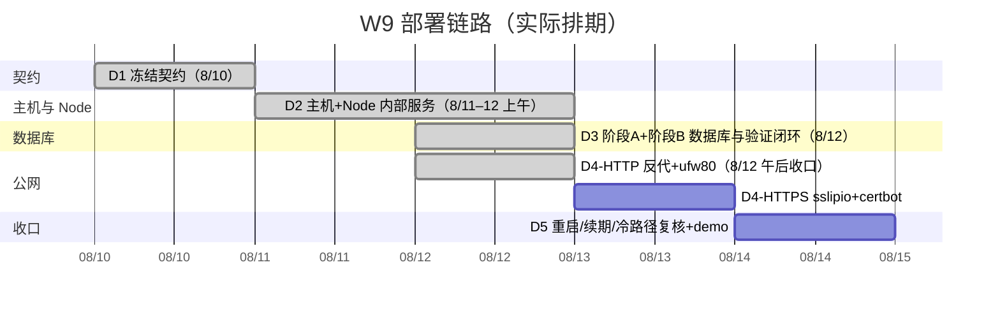
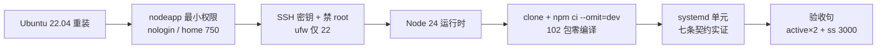
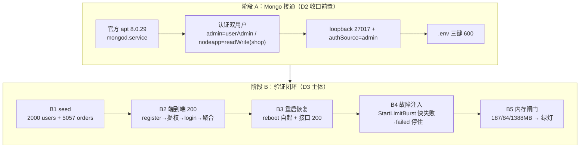
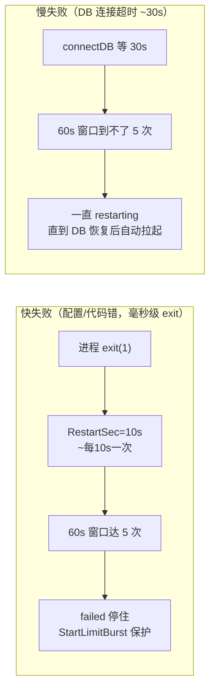
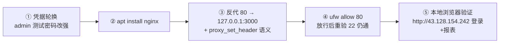

# W9 部署链路 Roadmap（D1–D4）

> 建立：2026-08-12（Asia/Shanghai），D3 收口后沉淀
> 上游事实：`day1-contract-freeze.md` / `day2-host-and-node-service.md` / `day3-finish-d2-and-db.md`（§4/§5 执行记录）、`LEARNING-STATE.md`
> 用途：三天已做内容的浓缩地图 + 下一步 D4-HTTP 入口；供新会话快速恢复与面试叙述

---

## 0. 一句话定位

这三天等于「**一个小型 Node 服务从零上线到一台云服务器并真实跑通**」的完整最小闭环，对应真实生产中单人小团队第一个 SaaS 版本上线的高质量形态；缺的 CI/CD（W11）、监控（W10）、备份/多环境在后续周补齐。

---

## 1. 目标拓扑（最终形态）

```mermaid
flowchart LR
    U["浏览器 / 客户端"] -->|HTTPS :443| NG["Nginx 反向代理<br/>80/443 → 127.0.0.1:3000<br/>D4 落地"]
    NG -->|HTTP 127.0.0.1:3000| ND["Node.js Express<br/>systemd 守护<br/>nodeapp.service"]
    ND -->|Mongo 认证 URI<br/>127.0.0.1:27017| MG["MongoDB 8.0.29<br/>systemd 守护<br/>mongod.service"]
    MG -->[(shop 库<br/>users 2000 / orders 5057)]

    FW["ufw 防火墙<br/>入站默认 deny"] -.控制.-> U
    FW -.仅放行 22 + 80.-> NG
    note["信任边界<br/>公网可达：仅 80/443/22<br/>3000/27017 只走 loopback"]
```

### 端口表（已冻结契约）

| 端口 | 监听地址 | 进程 | 公网可达 | 状态 |
|---|---|---|---|---|
| 22 | 0.0.0.0 | sshd | ✅（仅公网密钥） | D2 已落地 |
| 80 | 公网 | Nginx → 127.0.0.1:3000 | ✅（HTTP） | **D4-HTTP 已落地**（8/12 收口） |
| 443 | 公网 | Nginx + 证书 | ✅（HTTPS） | D4-HTTPS 待做 |
| 3000 | 127.0.0.1 | node | ❌ | D2 已落地（loopback 实证） |
| 27017 | 127.0.0.1 | mongod | ❌ | D3 已落地（loopback 实证） |

---

## 2. 日程总览



---

## 3. 每日详细（已完成 D1–D3）

### D1（8/10）：契约冻结 —— 先定边界再动手

| 决策点 | 冻结结论 |
|---|---|
| 目标应用 / 验收接口 | `week2-express/src/` + `GET /reports/monthly-sales` |
| 云资源 | 腾讯云首尔二区 2C/2G/40GB，到期 2026-11-10 |
| 拓扑 | 外部 → Nginx → systemd Node → loopback MongoDB |
| 进程守护 | systemd 唯一主方案；pm2 只对比不实现 |
| MongoDB 网络边界 | 同机、仅 loopback、认证启用、只读业务库最小权限 |
| 域名路线 | sslip.io 免费子域名；签发失败回退 IP+HTTP |
| 错误处理哲学 | 「启动即失败按 StartLimitBurst 停住而非无限重启」→ 今天 D3 B4 才补验成 |

**可迁移能力**：把模糊需求变成验收句 + 信任边界；「步骤表必须在决策冻结后重推」的教训（D2 缺陷）。

---

### D2（8/11–12）：主机与 Node 内部服务



| 关键事件 | 证据 / 结论 |
|---|---|
| bcrypt 安装机制 | **prebuildify**：产物打进 npm 包、零下载零现场编译（推翻 node-pre-gyp 假设）；npm 11 `allowScripts` 生效（修正 D2 §2.2 推断） |
| npm ci --omit=dev | 102 包 5s 完成、无 memory-server/gyp 字样；**OOM 闸门风险实质解除** |
| systemd 七条契约 | kill -9 自动拉起 / ~11s 退避 / SIGTERM 优雅关闭 / 30s 超时 / enabled / journald / 限速配置落位 |
| 认知修正 | umask=002 三重证据闭合（775 权限）；「root 挡不住 600」三现收敛；nologin 不能 `su -` |

**可迁移能力**：最小权限用户、防火墙白名单思维、进程守护与失败恢复的真实机理、「退出码 0 ≠ 路径正确」要看过程证据。

---

### D3（8/12）：数据库接通 + 全链路验证闭环（今天）



#### 阶段 B 五项明细

| # | 内容 | 关键结果 | 证据 |
|---|---|---|---|
| B1 | seed | 2000 用户 + 5057 订单；**实测推翻 3.1 自查预测**——内置 `readWrite` 含 createIndexes，email unique 索引建成 | `getIndexes()` → `email_1 unique:true` |
| B2 | 端到端 200 | register admin（bcrypt 12）→ 提权 → login JWT → `?months=6` 6 个月聚合数据（月份序列 + 量级锚点核验） | 2581 单 / 155 万销售额 / 8 月 314 单 |
| B3 | 重启恢复 | reboot 后双服务 enabled+active 自起、接口 200；**时区边界观察点**：聚合 `$year/$month` 按 UTC vs 服务器 CST → 凌晨订单跨月归因（7 月 3 单） | is-enabled ×2 + `?months=1` 200 |
| B4 | 欠账销账 | 第一轮实证 **Wants 连带拉起 mongod**（注入盲区）；第二轮**快失败注入**（JWT_SECRET 改短）→ StartLimitBurst → failed 停住 → 恢复 200 | journal「restart counter at 5 / Start request repeated too quickly」 |
| B5 | 内存闸门 | mongod **187.4MB** / nodeapp **83.9MB** / available **1388MB** → D4 Nginx **绿灯** | /proc VmRSS + free -m |

#### 重要：两个 systemd 行为（面试常问）



**关键结论**：`Wants=mongod.service` 会连带拉起依赖；StartLimitBurst 真正保护的是**崩溃循环**（快失败），不是慢依赖等待。

**可迁移能力**：认证/授权/数据验证链、故障注入设计（先想清依赖语义再注入）、RSS 实测驱动容量决策、时区边界意识。

---

## 4. 与真实生产的对照

### 已做（真实生产也在做）

| 我们做的 | 真实生产对应 |
|---|---|
| 云主机初始化、非 root、SSH 密钥、ufw 最小放行 | 任何云部署基础层（ECS/EC2/裸金属） |
| git clone + `npm ci --omit=dev` | CI 产物上机步骤的手工等效 |
| Node + systemd 守护 + 开机自启 | 中小公司/自托管/单机部署标准形态 |
| MongoDB 同机 + 认证 + 最小权限 + loopback | 安全基线：库不暴露公网、最小授权 |
| `.env` 600 + 密钥分离 | secret 管理最简形态 |
| seed / 端到端 / 重启 / 故障注入 | 验证心智：不是「跑通就行」 |

### 缺（诚实边界，后续周补）

| 缺口 | 归属 |
|---|---|
| 反向代理 + HTTPS + 证书续期 | **D4**（HTTP 拆分先行） |
| CI/CD 发布与回滚 | W11 |
| 监控/告警/日志聚合 | W10 |
| 备份 + 恢复演练 | 未排 |
| 多环境 isolation | 未排（单台直上 prod） |
| 水平扩展/多 AZ | 单机，范围外 |

---

## 5. 认知修正清单（执行期真实沉淀）

| # | 修正 | 来源 |
|---|---|---|
| 1 | bcrypt 机制：node-pre-gyp → **node-gyp-build/prebuildify**（零编译） | D3 槽位 b |
| 2 | npm 11 `allowScripts` **生效**（推翻 D2 §2.2 推断） | D3 槽位 b |
| 3 | 「root 挡不住 600」三现收敛；nologin 不能 `su -` | D2/D3 |
| 4 | `ping` ≠ 认证判定命令（用 `listDatabases` 语义明确命令） | D3 槽位 e |
| 5 | `systemctl restart` 异步，返回 ≠ 端口已 bind | D3 槽位 e |
| 6 | 网页终端 `read -s` 读不到 stdin（len=0 实证）→ 用 export 赋值 | D3 B2 |
| 7 | `node -e` ESM import 按 cwd 解析模块（`/home/ubuntu/[eval1]`） | D3 B2 |
| 8 | `Wants` 在 start 时**连带拉起**依赖服务 | D3 B4 第一轮 |
| 9 | **快失败 vs 慢失败**是 StartLimitBurst 设计核心 | D3 B4 第二轮 |
| 10 | 聚合 `$year/$month` 按 UTC，服务器 CST → 时区边界 | D3 B3 |

---

## 6. D4-HTTP（已完成，2026-08-12 收口）



- **唯一验收已达成**：本地开发机 `http://43.128.154.242` 走通登录（POST /auth/login 200）+ 报表（GET /reports/monthly-sales?months=6 200 真实数据）
- **止步条件满足**：外部 200 + 凭据轮换完成（admin 密码已轮换为密码管理器托管强密码，登录实测 200）
- **执行记录见**：[`day4-http-reverse-proxy.md`](./day4-http-reverse-proxy.md)
- **关键设计结论**：反代后 Host/X-Forwarded-* 语义已答（理论四类 header + trust proxy）；读代码后应用不消费 req.ip/protocol/hostname → 只配 `Host $host`，不配 XFF/XFP、不做 trust proxy（最小改动，详见 day4 笔记 §4.2）
- **下一步**：D4-HTTPS（certbot + sslip.io + 443；失败回退 IP+HTTP——HTTP 基线已可访问）

---

## 7. 新会话恢复入口

```
按 LEARNING-PROTOCOL.md 恢复状态 → LEARNING-STATE.md → week9-plan.md（D1✓D2✓D3✓）→ day3-finish-d2-and-db.md → 本文件 §6 执行 D4-HTTP