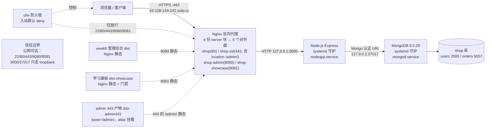
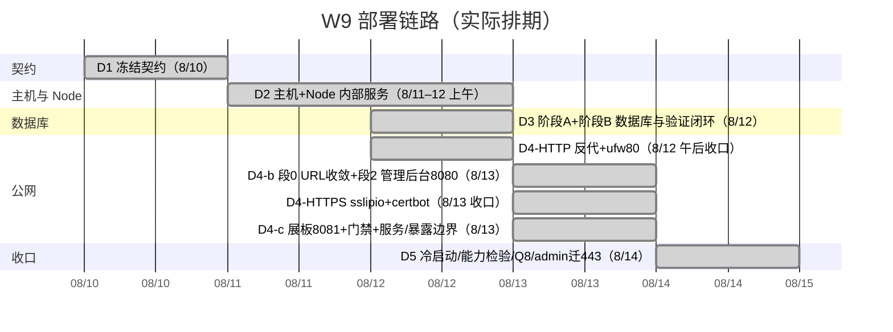
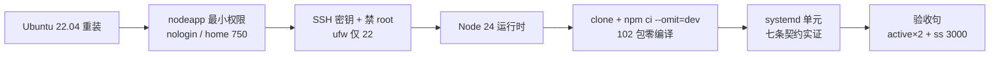
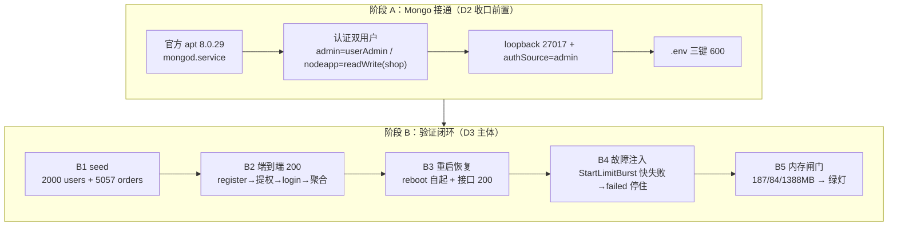
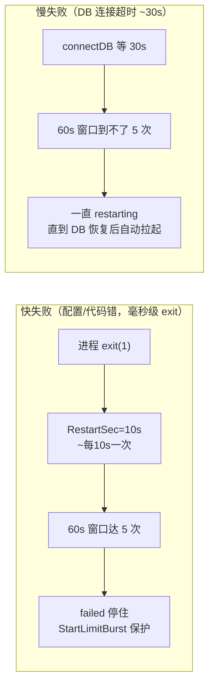
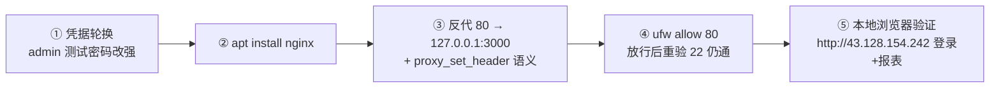
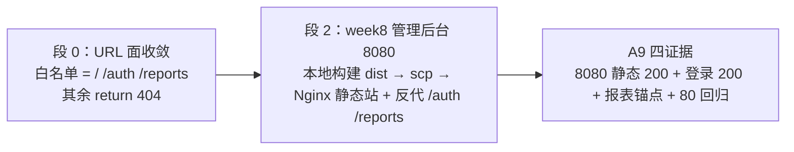
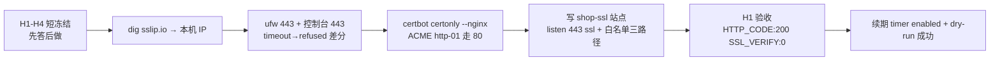

# W9 部署链路 Roadmap（D1–D5 全周）

> 建立：2026-08-12（Asia/Shanghai），D3 收口后沉淀；8/13 追加 D4-b + D4-HTTPS + D4-c；**8/14 追加 D5 收口，W9 全周完成**
> 文件名仍是 `week9-roadmap-d1-d4.md`：多处笔记、`LEARNING-STATE.md` 与展板笔记 tab 都按这个名字引用，改名的收益不抵重连所有引用的成本。以本标题为准。
> 上游事实：`day1-contract-freeze.md` / `day2-host-and-node-service.md` / `day3-finish-d2-and-db.md`（§4/§5 执行记录）、`day4-http-reverse-proxy.md`、`day4b-https-and-admin-plan.md`、`day4c-showcase-gate-deploy.md`、`day5-rebuild-closeout.md`、`server-permission-cheatsheet.md`、`LEARNING-STATE.md`
> 用途：W9 全周已做内容的浓缩地图；供新会话快速恢复与面试叙述

---

## 0. 一句话定位

W9 等于「**一个小型 Node 服务从零上线到一台云服务器、公网 HTTPS 可访问、证书有效，并且改它的时候有一套纪律**」的完整最小闭环——五天连 HTTP 反代、URL 面收敛、week8 后台、HTTPS 证书、学习展板与门禁全打通，最后一天补上冷启动自愈复核、应用层鉴权与一次按变更单执行的发布，对应真实生产中单人小团队第一个 SaaS 版本上线的高质量形态；缺的 CI/CD（W11）、监控（W10）、备份/多环境在后续周补齐。

D5（8/14）做完的五件事：冷启动验证 → 信任边界复核 → 能力检验口述（当场修正 8 处）→ Q8 安全债还清 → admin 迁 443（按变更单发布）。三项收口决策：Q8 今天做、admin 迁 443 今天做、时区**明确不修**。

---

## 1. 目标拓扑（最终形态）



> 上图有两处以前画不出来、8/14 才成立的东西：**四份 server 块开出五个对外面**（第五个是 `location`，不是端口），以及 **`dist-admin443` 这份独立产物**——它和 8080 在用的 `dist` 是同一份代码的两种 base 形态，不能共用目录。

### 端口表（已冻结契约，8/14 reboot 后复核不变）

| 端口 | 监听地址 | 进程 | 公网可达 | 状态 |
|---|---|---|---|---|
| 22 | 0.0.0.0 | sshd | ✅（仅公网密钥） | D2 已落地 |
| 80 | 公网 | Nginx → 127.0.0.1:3000（白名单三路径） | ✅（HTTP） | **D4-HTTP + D4-b 段 0**（8/12–13 收口） |
| 443 | 公网 | Nginx + certbot 证书 → 127.0.0.1:3000 | ✅（HTTPS） | **D4-HTTPS 已落地**（8/13 收口，SSL_VERIFY:0） |
| 8080 | 公网 | Nginx 静态 → dist + 反代 /auth /reports | ✅（HTTP 明文） | **D4-b 段 2**（8/13 收口）；admin 迁 443 后转为**过渡期保留**，明文短板已知 |
| 8081 | 公网 | Nginx 静态 → dist-showcase + 反代 /auth（学习展板 + 登录门禁） | ✅（HTTP 明文） | **D4-c**（8/13 收口） |
| 3000 | 127.0.0.1 | node | ❌ | D2 已落地（loopback 实证） |
| 27017 | 127.0.0.1 | mongod | ❌ | D3 已落地（loopback 实证） |

> ❌ 不是「没在用」：3000/27017 是 **loopback 内线**（服务器内部访问正常，Nginx→Node→Mongo 第三跳都靠它），只是公网摸不到。对应白话：「外面能摸到哪一层」——公网请求最多到 Nginx。

### 第五个对外面：443 的 `/admin/`（8/14 新增，不是新端口）

| 面 | 承载形态 | serve 什么 | 状态 |
|---|---|---|---|
| `https://<域名>/admin/` | **shop-ssl 里的一个 `location`**，不是新 server 块、不是新端口、不是新证书 | `alias` 到 `dist-admin443/`（构建期 base 就是 `/admin/`） | **D5 已落地**（8/14），200 + 浏览器实测登录 |

> 从 8/14 起，**「对外面数」与「server 块数」不再是同一个数字**：5 个面 / 4 份 server 块。8/13 之前它们一直相等，所以从来没必要分开数。
>
> 这也是 D4-c §5 那三种暴露面切分方式（端口 / 域名 / 路径）里**路径**的第一次落地。为什么这次不再用端口：**证书按域名签，不按端口签**——8081 至今明文正是「用端口切分」的账单，而 admin 想要 TLS，复用 443 已有的那张证书是零成本的。

---

## 2. 日程总览



---

## 3. 每日详细（已完成 D1–D3）

### D1（8/10）：契约冻结 —— 先定边界再动手

| 决策点 | 冻结结论 |
|---|---|
| 目标应用 / 验收接口 | `week2-express/src/` + `GET /reports/monthly-sales` |
| 云资源 | 腾讯云首尔二区 2C/2G/40GB，到期 2026-11-10 |
| 拓扑 | 外部 → Nginx → systemd Node → loopback MongoDB |
| 进程守护 | systemd 唯一主方案；pm2 只对比不实现 |
| MongoDB 网络边界 | 同机、仅 loopback、认证启用、只读业务库最小权限 |
| 域名路线 | sslip.io 免费子域名；签发失败回退 IP+HTTP |
| 错误处理哲学 | 「启动即失败按 StartLimitBurst 停住而非无限重启」→ 今天 D3 B4 才补验成 |

> 8 个问题的完整问答（验收接口 / 数据 / 凭据 / 监听 / 端口 / 守护 / 域名 / 复现）见 [`day1-contract-freeze.md`](./day1-contract-freeze.md) §4——roadmap 只留结论，不重复推理。

**可迁移能力**：把模糊需求变成验收句 + 信任边界；「步骤表必须在决策冻结后重推」的教训（D2 缺陷）。

---

### D2（8/11–12）：主机与 Node 内部服务



| 关键事件 | 证据 / 结论 |
|---|---|
| bcrypt 安装机制 | **prebuildify**：产物打进 npm 包、零下载零现场编译（推翻 node-pre-gyp 假设）；npm 11 `allowScripts` 生效（修正 day2 笔记 §2.2 推断） |
| npm ci --omit=dev | 102 包 5s 完成、无 memory-server/gyp 字样；**OOM 闸门风险实质解除** |
| systemd 七条契约 | kill -9 自动拉起 / ~11s 退避 / SIGTERM 优雅关闭 / 30s 超时 / enabled / journald / 限速配置落位 |
| 认知修正 | umask=002 三重证据闭合（775 权限）；「root 挡不住 600」三次同形态出现才定论；nologin 不能 `su -` |

**可迁移能力**：最小权限用户、防火墙白名单思维、进程守护与失败恢复的真实机理、「退出码 0 ≠ 路径正确」要看过程证据。

---

### D3（8/12）：数据库接通 + 全链路验证闭环（今天）



#### 阶段 B 五项明细

| # | 内容 | 关键结果 | 证据 |
|---|---|---|---|
| B1 | seed | 2000 用户 + 5057 订单；**实测推翻 day3 笔记 §3.1 自查预测**——内置 `readWrite` 含 createIndexes，email unique 索引建成 | `getIndexes()` → `email_1 unique:true` |
| B2 | 端到端 200 | register admin（bcrypt 12）→ 提权 → login JWT → `?months=6` 6 个月聚合数据（月份序列 + 量级锚点核验） | 2581 单 / 155 万销售额 / 8 月 314 单 |
| B3 | 重启恢复 | reboot 后双服务 enabled+active 自起、接口 200；**时区边界观察点**：聚合 `$year/$month` 按 UTC vs 服务器 CST → 凌晨订单跨月归因（7 月 3 单） | is-enabled ×2 + `?months=1` 200 |
| B4 | 欠账销账 | 第一轮实证 **Wants 连带拉起 mongod**（注入盲区）；第二轮**快失败注入**（JWT_SECRET 改短）→ StartLimitBurst → failed 停住 → 恢复 200 | journal「restart counter at 5 / Start request repeated too quickly」 |
| B5 | 内存闸门 | mongod **187.4MB** / nodeapp **83.9MB** / available **1388MB** → D4 Nginx **绿灯** | /proc VmRSS + free -m |

#### 重要：两个 systemd 行为（面试常问）



**关键结论**：`Wants=mongod.service` 会连带拉起依赖；StartLimitBurst 真正保护的是**崩溃循环**（快失败），不是慢依赖等待。

> 白话：B4「销账」= 把 D2 选 A 欠下的「Mongo 缺失 → 启动即失败 → 不无限重启」契约补验证掉。「快失败」= 秒级崩 → 60s 内撞 5 次 → 罚下场停住；「慢失败」= 等依赖（~30s）→ 60s 到不了 5 次 → 一直 restarting 直到依赖恢复。StartLimitBurst 只治前者。

**可迁移能力**：认证/授权/数据验证链、故障注入设计（先想清依赖语义再注入）、RSS 实测驱动容量决策、时区边界意识。

---

## 4. 与真实生产的对照

### 已做（真实生产也在做）

| 我们做的 | 真实生产对应 |
|---|---|
| 云主机初始化、非 root、SSH 密钥、ufw 最小放行 | 任何云部署基础层（ECS/EC2/裸金属） |
| git clone + `npm ci --omit=dev` | CI 产物上机步骤的手工等效 |
| Node + systemd 守护 + 开机自启 | 中小公司/自托管/单机部署标准形态 |
| MongoDB 同机 + 认证 + 最小权限 + loopback | 安全基线：库不暴露公网、最小授权 |
| `.env` 600 + 密钥分离 | secret 管理最简形态 |
| seed / 端到端 / 重启 / 故障注入 | 验证心智：不是「跑通就行」 |
| **应用层鉴权 + 反代白名单两层**（8/14 Q8） | 纵深防御：404 挡门外汉，401 挡进了内线的无身份请求 |
| **发布变更单**（8/14）：改动清单 / 每项验证先写期望值 / 回滚还原点 / 止步条件 | 变更管理最简形态——CI/CD 脚本要复刻的正是这几样 |
| **冷启动自愈复核**（8/14）：亲手 reboot 一次 | 灾备演练的最小形态：验的是整个拓扑回得来，不是某个进程还活着 |

### 缺（诚实边界，后续周补）

| 缺口 | 归属（8/14 更新） |
|---|---|
| 反向代理 + HTTPS + 证书续期 | **D4 已补齐**（8/13 收口） |
| 应用层鉴权 | **D5 已补齐**（8/14 Q8 还清） |
| 8080 明文面下线 | admin 已迁 443，8080 按发布纪律留过渡期；明文登录表单仍在 |
| HTTP→HTTPS 301；8081 仍明文 | 80 目前是证书续期的硬依赖，只能「关业务不关端口」 |
| 配置的可追溯：服务器 `shop-ssl` 的改动不在 git | 靠手工同步 `shop-ssl.conf` 副本；长期并进 W11 发布自动化 |
| 自有可控域名 + DNS 面板 | 未排（sslip.io 零成本替代，非可控） |
| CI/CD 发布与回滚 | W11 |
| 监控/告警/日志聚合 | W10 |
| 备份 + 恢复演练 | 未排 |
| 多环境 isolation | 未排（单台直上 prod） |
| 水平扩展/多 AZ | 单机，范围外 |

---

## 5. 认知修正清单（执行期真实沉淀）

| # | 修正 | 来源 |
|---|---|---|
| 1 | bcrypt 机制：node-pre-gyp → **node-gyp-build/prebuildify**（零编译） | D3 槽位 b |
| 2 | npm 11 `allowScripts` **生效**（推翻 day2 笔记 §2.2 推断） | D3 槽位 b |
| 3 | 「root 挡不住 600」三次同形态出现才定论；nologin 不能 `su -` | D2/D3 |
| 4 | `ping` ≠ 认证判定命令（用 `listDatabases` 语义明确命令） | D3 槽位 e |
| 5 | `systemctl restart` 异步，返回 ≠ 端口已 bind | D3 槽位 e |
| 6 | 网页终端 `read -s` 读不到 stdin（len=0 实证）→ 用 export 赋值 | D3 B2 |
| 7 | `node -e` ESM import 按 cwd 解析模块（`/home/ubuntu/[eval1]`） | D3 B2 |
| 8 | `Wants` 在 start 时**连带拉起**依赖服务 | D3 B4 第一轮 |
| 9 | **快失败 vs 慢失败**是 StartLimitBurst 设计核心 | D3 B4 第二轮 |
| 10 | 聚合 `$year/$month` 按 UTC，服务器 CST → 时区边界 | D3 B3 |
| 11 | **端口边界 ≠ URL 面边界**：`location /` 整段反代把端口收敛收益从 URL 层还回去 | D4-b 段 0 |
| 12 | **反代不读盘 vs 静态服务要读盘**：`/home/nodeapp` 750 无 o+x → 静态 403、反代 80 不受影响 | D4-b B3 |
| 13 | 腾讯云控制台防火墙与 ufw 是**两层独立防线**（放行后外部仍超时 → 查控制台） | D4-b B5 / D4-HTTPS |
| 14 | **超时=安全组/路由丢包；拒绝=包已进内核但无监听**（timeout→refused 差分） | D4-HTTPS Step 2 |
| 15 | 连接失败时 `SSL_VERIFY:0` 是**默认空值、不代表证书可信**（成功后才具信任语义） | D4-HTTPS Step 0 |
| 16 | shell **反引号是命令替换**：误把 grep 443 的输出再当命令执行 → No such file（报错反证规则在） | D4-HTTPS 补救 |
| 17 | **服务边界 ≠ 暴露边界**：加 Nginx 入口 ≠ 加业务；服务数看进程、入口数看 server block | D4-c §4 |
| 18 | **构建产物需分目录**：同一仓库两个 UI 站点若共用 `dist/`，后构建覆盖对方产物（admin.html/showcase.html 互删） | D4-c §2.3 |
| 19 | **前端登录门禁只挡浏览器**：静态内容在 bundle 里，curl 可抓；「挡路人」档位必须接受这个边界 | D4-c §1.3 |
| 20 | **Nginx 选入口靠 listen 端口 + ssl 指令**，Host/server_name 只在「多域名共享同端口」时才参与；本机一 block 一端口，Host 不参与选择 | D5 C1（口述修正 1） |
| 21 | **URL 面收敛 = 枚举精确路径，不是放前缀**：段 0 冻结的是 `= /` + `/auth` + `/reports`，不是 `/api/` 这类前缀 | D5 C1（口述修正 2a） |
| 22 | **拒绝形态统一用 404 不用 403**：403 等于告诉扫描器「这个路径存在，你没权限」，反而是给他指路 | D5 C1（口述修正 2b） |
| 23 | **80/443 是纯反代面，不读盘**；读盘的静态在 8080/8081——静态资源归属不能想当然 | D5 C1（口述修正 2c） |
| 24 | **数据读取有五层不能压扁**：Controller → Service → Repository → Mongoose Model → MongoDB；返回值 BSON → Document → Plain Object → JSON | D5 C1（口述修正 2d） |
| 25 | **本机进程守护是 systemd 不是 pm2**，日志用 `journalctl -u nodeapp`；pm2 只做边界对比不实现 | D5 C2（口误纠正） |
| 26 | **80 当前是完整 API 面，不是 301 发射台**；「301 发射台」是全迁 HTTPS 之后的规划，两者别混说 | D5 C3（现状断言修正 3a） |
| 27 | **8080/8081 是公网暴露面不是内网端口**（ufw ALLOW Anywhere + 公网实测 200）；它们不受关 80 影响是因为「独立端口无耦合」，不是因为绑了内网 | D5 C3（现状断言修正 3b） |
| 28 | **认证授权先于参数校验的理由是「最粗粒度准入先止损」**，不是「避免 Mongoose CastError」——`validateIdParam` 是纯格式校验，不查库、不碰 Mongoose | D5 Q8 D2（AI review 纠正） |
| 29 | **两份 base 不同的产物不能共用一个目录**：带 `/admin/` base 的产物覆盖到 8080 在用的 `dist`，会让 8080 首页引用 `/admin/assets/...` 而整站 404 | D5 §10.6（执行期发现） |
| 30 | **`alias` 与 `root` 的路径映射不同**：`root` 会把 `/admin/assets/x.js` 映射成 `dist-admin443/admin/assets/x.js`（多一层），`alias` 才是替换前缀 | D5 §10.6 踩点 ③ |
| 31 | **git 的 `dubious ownership` 与 `FETCH_HEAD: Permission denied` 是同一个根因的两个报错**：仓库属主 nodeapp ≠ 登录身份 ubuntu。绕过第一个只会把你送到第二个——正解是 `sudo -u nodeapp` | D5 §10.6 踩点 ②（详见权限速查表） |
| 32 | **timer 跑过 ≠ 证书续过**：`certbot.timer` 的 LAST 只证明检查跑了；剩余天数 >30 会直接跳过，真正的续签要等到期前 30 天内 | D5 A 模块 |

---

## 6. 公网化与收口（D4 各线 + D5）

> 本节按落地顺序排：6.0 反代打通 → 6.1 URL 面收窄 + 管理后台 → 6.2 上 TLS → 6.3 展板与门禁 → 6.4 收口日。
> 编号刻意不重排——`§8.1` / `§8.2`（白话对照表）被展板词表与多份笔记按号引用。

### 6.0 D4-HTTP（已完成，2026-08-12 收口）



> 白话：反代 = 反向代理 = **门卫**——外部只认 80 端口，Nginx 收到请求后转交给内部 127.0.0.1:3000 的 Node，Node 的真实地址对外不可见。

- **唯一验收已达成**：本地开发机 `http://43.128.154.242` 走通登录（POST /auth/login 200）+ 报表（GET /reports/monthly-sales?months=6 200 真实数据）
- **止步条件满足**：外部 200 + 凭据轮换完成（admin 密码已轮换为密码管理器托管强密码，登录实测 200）
- **执行记录见**：[`day4-http-reverse-proxy.md`](./day4-http-reverse-proxy.md)
- **关键设计结论**：反代后 Host/X-Forwarded-* 语义已答（理论四类 header + trust proxy）；读代码后应用不消费 req.ip/protocol/hostname → 只配 `Host $host`，不配 XFF/XFP、不做 trust proxy（最小改动，详见 day4 笔记 §4.2）
> 白话：反代转发时 Node 会看到三个「失真信息」——客户端真实 IP（变成 127.0.0.1）、原始协议（恒为 http）、原始 Host。补传方案是加 `X-Real-IP` / `X-Forwarded-For` / `X-Forwarded-Proto` 头（XFF=原始 IP，XFP=原始协议），且 Express 要 `trust proxy` 才信这些头。**本应用读代码后不消费这三类字段 → 只配 `Host $host`，其余都不配**（最小改动）。
- **下一步**：~~D4-HTTPS~~（已收口，见 §6.2）

---

### 6.1 D4-b（已完成，2026-08-13 收口）：URL 面收敛 + week8 管理后台 8080



- **核心学习点（端口边界 ≠ URL 面边界）**：D4-HTTP 是 `location /` 整段反代——端口收敛（3000 不进公网）的收益又被 URL 层还了回去；任意人可 GET `/users` 2000 条用户记录、可 DELETE。段 0 用 Nginx 白名单封堵（Q3 选 A：只做反代层，应用层鉴权记 Q8 安全债）。
- **两处关键实证**：① **反代不读盘 vs 静态服务要读盘**——`/home/nodeapp` 750 无 o+x → 8080 静态 403、80 反代不受影响；`chmod o+x` → 751 → 200。② 腾讯云控制台防火墙与 ufw 是**两层独立防线**——ufw 放行 8080 后公网仍 SYN DROP → 控制台加规则 → 400 JSON 全链路贯串。
- **唯一验收（A9 四证据）**：8080 `/` 200、登录 200 + token、报表首月 `{"orderCount":258,"year":2026,"month":3,"totalSpending":146988.82}`、80 回归 `/`→200 `/users`→404。
- 执行记录见 [`day4b-https-and-admin-plan.md`](./day4b-https-and-admin-plan.md) §3/§5。

---

### 6.2 D4-HTTPS（已完成，2026-08-13 收口）：443 + sslip.io + certbot



- **白话**：HTTPS = 给网站的「门卫+Nginx」再加一道「门牌验证」——浏览器先问 Nginx「你是 43-128-154-242.sslip.io 吗？」（TLS 握手 + SNI），Nginx 出示 Let's Encrypt 签发的证书，浏览器用系统内置根证书验证「这张证书被公认机构信任」（`SSL_VERIFY:0`）才开始传输。证书 90 天到期，certbot.timer 每天两次检查，到期前自动续期（dry-run 已实证）。
- **关键命令 / 输出**：`curl -sS -o /dev/null -w "HTTP_CODE:%{http_code}\nSSL_VERIFY:%{ssl_verify_result}\n" https://43-128-154-242.sslip.io` → `HTTP_CODE:200 SSL_VERIFY:0` 才叫「HTTPS 通」——200 只证明服务活着，**证书被系统信任**靠 `ssl_verify_result:0`（不带 `-k`）。
- **两张排查判据**：① 超时 = 包没到（安全组/路由把 SYN 丢了）；拒绝 = 包进内核但无监听（Nginx 没配 443）——「timeout→refused 差分」现场实证闭合。② SSL_VERIFY≠0 且 200 → 证书层问题；连握手都完成不了 → Nginx 443 配置层问题。
- **80 保留三理由**（H2 冻结）：ACME http-01 挑战硬编码走 80（首发 + 90 天续期都靠它）；80 是段 0 存活锚点 +「HTTPS 挂了靠 80 区分应用坏 vs 证书错」；未来 301 跳转从 80 发。
- 执行记录见 [`day4b-https-and-admin-plan.md`](./day4b-https-and-admin-plan.md) §4.3（H1–H4 冻结 + Step 0–8 + 流程偏差留痕）。
- **落盘配置的本地副本**：[`shop-ssl.conf`](./shop-ssl.conf) —— 服务器 `/etc/nginx/sites-available/shop-ssl` 的原样拷贝（`/etc/nginx` 不在 git 里，这份是仓库内唯一可追溯的形态）。白名单三路径与 80 站点逐字相同：URL 面收敛是从段 0 继承过来的，不是重新配的。**8/14 起这份副本还多了一个 `location /admin/`**——那是第五个对外面的全部内容。

---

### 6.3 D4-c（已完成，2026-08-13 收口）：学习展板 8081 + 登录门禁

- **做了什么**：给纯静态学习展板加一层登录门禁（形态乙：独立登录页，复用后端 `/auth`），并把它独立部署到 8081。构建产物随之分目录：`OUT_DIR = SHOWCASE ? dist-showcase : dist`。
- **为什么必须分目录**：8080 与 8081 原本共用 `dist/`，后构建的一方会把另一方的入口文件删掉（`admin.html` / `showcase.html` 互删），必有一个站点拿到残缺产物。
- **门禁的边界要说清**：它只挡「随手打开链接的浏览器用户」。静态内容本来就在 bundle 里，curl 抓得到——把门禁说成内容边界就是自欺。
- **本线最值钱的心智（服务边界 ≠ 暴露边界）**：加一个 Nginx 入口不等于加一个业务。**数服务看进程，数入口看门**——当天全程 nodeapp 一次没重启。
- 执行记录见 [`day4c-showcase-gate-deploy.md`](./day4c-showcase-gate-deploy.md)。

---

### 6.4 D5（已完成，2026-08-14 收口）：冷启动 + 能力检验 + Q8 + admin 迁 443


**A 冷启动自愈**：`sudo reboot` 亲手触发。四个服务（nodeapp / mongod / nginx / **certbot.timer**）全部 enabled + active——注意这比 D1 冻结时多了两个，拓扑长大了，冷启动要复核的面也跟着宽了。3000/27017 仍只绑 loopback；四个公网面六条复测与重启前逐条一致。

> **一次档位升级**：`certbot.timer` 这次看到了 `LAST 8/14 04:14:01`。8/13 手里只有 `enabled` 与 `NEXT`，说「它每天会跑两次」是从配置推的；看到 LAST 才第一次有了观察。但**跑过 ≠ 续过**——timer 触发的是检查，剩余天数 >30 就跳过。
>
> **这次验收没碰数据库**：打的是根路径 200 与两个 404，都不查库。数据面在重启后正常，是当天晚些时候浏览器登录 + 报表锚点 258 才补上的。「四面全通」不等于「一切正常」。

**C 能力检验**：三关口述全过，但暴露并当场修正 **8 处**事实错误（见 §5 第 20–27 条）。这 8 处的价值不在数量，在于它们全部集中在「我以为最熟的那几层」——讲一遍才发现，读一百遍不会发现。

**Q8 还债**：`usersRouter.use(validateToken, requireRole('admin'))` 一行统一挂。选统一挂而不是逐条挂的理由是 **fail-closed**：逐条挂漏一条就是一个裸奔端点，统一挂让新增端点自动继承守卫。验收 = 无 token 401 / member 403 / admin 200 + jest 3 suites 9 tests 全过 + 线上复现。

> 还清之后同一个 `GET /users` 会走出**两条路**：公网走到 Nginx 被 **404** 挡下（信息隐藏，段 0 白名单）；服务器内直连 3000 被应用层 **401** 挡下。两个数字回答的是两个问题，而且**只有绕过 Nginx 才看得见后者**——验证它必须换一个发起位置，这本身就是双层的证据。

**admin 迁 443（按变更单发布）**：定位是「暴露面迁移 + TLS 加固」，不是功能开发——服务边界不变（还是同一个 nodeapp:3000），变的只有暴露边界与传输层。

变更单四要素：改动清单（今天就这几项）/ 每项验证**先写期望值** / 回滚还原点 / 止步条件。六项验证的覆盖分布是这次发布的风险画像：

| # | 验证 | 在哪跑 | 期望 | 验的是哪一层 |
|---|---|---|---|---|
| ① | 构建资源前缀 | 本地构建期 | 带 `/admin/` 前缀 | 新入口 |
| ② | preview 先验 base | 本地预演 | 页面加载、无资源 404 | 新入口 |
| ③ | 443 的 `/admin/` | 线上公网 | 200 + 资源 200 | 新入口 |
| ④ | 443 报表无 token | 线上公网 | **401（不是 200）** | 应用层守卫 **+** 旧面回归 |
| ⑤ | 直连 3000 的 `/users` | **服务器内** | 401 | 应用层守卫 |
| ⑥ | 四面回归 | 线上公网 | 200 / 404 / 200 三面保持 | 旧面回归 + 公网兜底 |

> 两个关键设计点：④ 期望写 **401 而非 200**，一次请求验两层——写成 200 会把「API 面没坏」和「Q8 上线了」一起放过去；⑤ **必须服务器内直连**，公网上 Nginx 的 404 挡在前面，应用层守卫根本露不出来。
>
> **产物二份制**（写单子逐项列改动时当场拦下的）：8080 与 443 的 `/admin/` 不能共用一份 `dist`——带 base 与无 base 是两种产物形态，互相引用会 404。按原方案覆盖过去，8080 首页会去引用 `/admin/assets/...` 而整站资源 404，过渡期入口当场废掉。改成独立目录 `dist-admin443/` 之后，回滚也变干净了：撤掉那个 `location` 就完事。

**E 收口决策**：Q8 今天做 ✅；admin 迁 443 今天做 ✅；**时区明确不修**（UTC 分组保留为已知口径，偏差约 3 单/月且只出现在凌晨那 8 小时的订单上，改口径要动聚合本身、会把 258 这个贯穿全周的锚点一起改掉）；`shop.bak` 已刷新为当前白名单形态（424B，4 个 location）——回滚基线从段 0 之前升级到当前稳定态，那个「拿旧备份回滚会成功、会通过 `nginx -t`、会 reload 正常，只是悄悄把一条安全边界退回去」的活破口就此闭合。

- 执行记录见 [`day5-rebuild-closeout.md`](./day5-rebuild-closeout.md)（§4 能力检验 / §5 Q8 / §10 变更单思维 / §11 收口决策）。
- 身份与权限的坑族集中在 [`server-permission-cheatsheet.md`](./server-permission-cheatsheet.md)：一条黄金规则是**凡是 nodeapp 的东西就 `sudo -u nodeapp`**。
- demo 动线见 [`day5-demo-script.md`](./day5-demo-script.md)：全场只坚持一句主张——部署不是把代码搬上去，是**给它加边界**。

---

## 7. 新会话恢复入口

```
按 LEARNING-PROTOCOL.md 恢复状态 → LEARNING-STATE.md
→ week9-plan.md（D1✓D2✓D3✓D4-HTTP✓D4-b✓D4-HTTPS✓D4-c✓D5✓，全周完成）
→ 本文件 §1 拓扑与两张面表 / §5 认知修正 32 条 / §6.4 D5 收口
→ day5-rebuild-closeout.md + server-permission-cheatsheet.md
→ W9 主线已收口；剩余清理项与并行线见 LEARNING-STATE.md「下一步」
```

---

## 8. 附录：抽象词与白话对照（新会话恢复用）

> 用途：roadmap 是浓缩地图、术语密度高。这张表给高频抽象词配一句白话，让新会话 30 秒进入状态。术语本身要学，白话负责唤醒真实场景。

### 8.1 可以直接白话化的词

| 词 | roadmap 里的意思 | 白话 |
|---|---|---|
| 信任边界 | 公网只开放 22/80/443/8080/8081，3000/27017 只走本机内部 | 外面能摸到哪一层 |
| 纵深防御 | 代码绑 127.0.0.1 + ufw + 云控制台防火墙三道独立防线 | 多道闸门，坏一道还有下一道 |
| 攻击面 | 暴露给攻击者能下手的入口数 | 攻击者能摸到的门有几扇 |
| 最小权限 | 进程只拿干活需要的权限 | 只发够用的钥匙 |
| 可证伪 | 验收句能说出「看到什么现象就不通过」 | 能说出失败长什么样 |
| 归因 | 预测 ≠ 实际时，找出是哪个前提错了 | 查清楚是谁的错 |
| 收口 | 尾巴做完，进入可停下的干净状态 | 结算、封口 |
| 冻结 | 先讲死，执行期不再改 | 定死不动摇 |
| 止步条件 | 做到什么就收工，不无限延伸 | 到这就停 |
| 唯一验收 | 整周只认这一条验收标准 | 只认这一条 |
| 冲突自查 | 检查自己的答案有没有互相打架 | 答案互查 |
| 反代 | 反向代理：外部只认 Nginx，内部服务藏后面 | 门卫转发 |

### 8.2 保留术语但配白话（术语本身要学）

| 词 | 白话 | roadmap 场景 |
|---|---|---|
| 契约 | 开工前讲死的规矩（端口 / 验收 / 边界） | D1 整篇 |
| 监听地址 | 进程在等哪扇门：0.0.0.0=朝外大街 / 127.0.0.1=屋里 | §1 端口表 |
| loopback | 本机自己跟自己通信的回路 | Nginx→Node、Node→Mongo |
| 快失败 / 慢失败 | 崩溃循环 vs 等待依赖；StartLimitBurst 只治前者 | D3 systemd 两行为 |
| 退避 | 失败后等一等再重试，不立刻连打 | systemd RestartSec |
| 内存闸门 | 装新服务前先实测内存余量够不够 | B5：187+84MB vs 1388MB |
| 带外通道 | 不走 SSH 的另一条管理路（腾讯云网页终端） | SSH 锁死时的退路 |
| 锚点核验 | 用已知量级数字验证聚合结果合理 | B2：2581 单 / 155 万 |
| 销账 | 把欠下的「未验证契约」补验证掉 | B4 故障注入 |
| 可迁移能力 | 这周学到、下个项目还能用的东西 | 每 D 末尾 |
| URL 面边界 | 与端口边界不同：端口收敛了、路径却全开，等于白收 | 门口锁了，屋里每扇门却没锁（段 0 学习点） |
| 白名单 | 只放行允许的路径 / 端口，其余默认拒绝 | 只发熟人进门，陌生人来一个挡一个 |
| SSL_VERIFY | 系统对证书信任程度的数字：0=通过，非 0=不信任 | 保安验「门牌真伪」的结果 |
| SNI | 客户端在 TLS 握手时告诉服务器「我要访问哪个域名」 | 进门先报门牌号 |
| http-01 挑战 | LE 经 80 访问你域名下的临时文件，证明你控制该域名 | 机构上门对暗号，暗号挂在你家门口（80） |
| 差分 | 控制变量对比，锁定是哪一层的问题 | 换一项看现象变不变，就知道是谁的锅 |
| certonly | 只签证书、不改你的 Nginx 配置（`--nginx` 全模式才会改写） | 只拿执照，不帮你装门脸 |
| 变更单 | 动手前写死四件事：改哪几项 / 每项验证的期望值 / 失败退到哪 / 做到什么程度就停 | 施工前先贴施工告示，写清楚动哪、验哪、坏了怎么退（D5 §10） |
| 期望值 | 验证之前先写下「应该看到什么」，而不是看到结果再解释 | 先押答案再开奖——没押过的验证只是「看了看」 |
| 对照组 | 这次不该被碰到的那几个面，用来证明改动没有溢出边界 | 没动的那几扇门也要挨个推一下 |
| fail-closed | 默认拒绝：新增端点自动继承守卫，而不是等你记得挂 | 门默认锁着，要开得专门去开 |
| 暴露面切分 | 用端口 / 域名 / 路径把不同入口分开，各有代价 | 开新门的三种开法：另开一扇、另立门牌、还是在老门里隔一间 |
| alias vs root | Nginx 两种路径映射：alias 替换掉匹配的前缀，root 在后面拼接 | 一个是换路牌，一个是在后面接一段路 |
| 冷启动自愈 | 整机重启后拓扑自己回得来，不需要人工介入 | 拔电重开，东西自己都回来了 |

### 8.3 守住已有好类比（别被「专业词」换回去）

门卫 / 接待（Nginx）· 管家（systemd）· 仓库（MongoDB）· 前台 / 店铺（Node）· 救生索（保留的 SSH 会话）· 两道闸门（监听地址 + 防火墙）

### 8.4 去掉动词包装

「收敛」「落地」「对齐」这类动词常是多余的：删掉后意思没丢就删。例：「信任边界收敛」→「信任边界划清楚」；「让 XX 落地」→「把 XX 做出来」。
